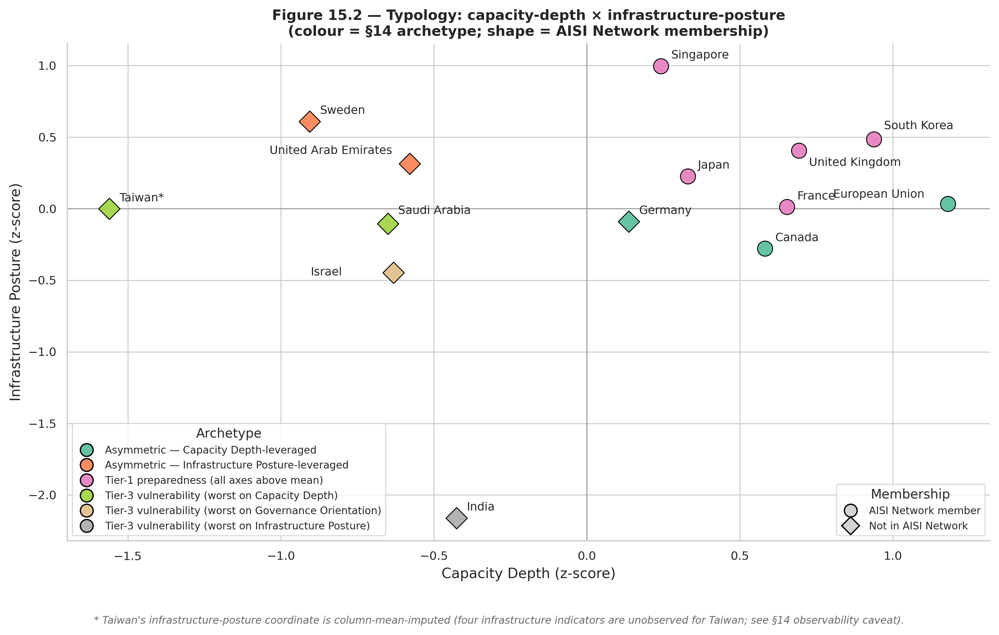
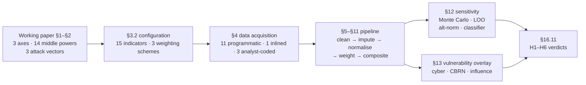

# Middle-Power AI Proliferation Preparedness Index (M-PAPI)

> Companion notebook to *AI-Proliferation and Middle Powers: Preparation and Response Mechanisms* (Teague, Ali, Sfeir, Fort — working paper, 2026).

The notebook empirically operationalises the working paper's three-axes framework — **Capacity Depth**, **Governance Orientation**, **Infrastructure Posture** — across the 14 middle powers named in the paper, and reports per-country preparedness rankings against the three attack vectors discussed in §2 (cyber, CBRN, influence operations).

> **Scope.** M-PAPI quantifies the paper's §1 (axes / country set) and §2 (attack vectors) only. The paper's §3 (trigger-event ladder) and §4 (Detection / Escalation / Mitigation & Containment checklist) are **not** operationalised here — a country-year AI-attributed incident dataset would be required for §3, and §4's checklist actions are surfaced in this notebook only as the §13.4 counterfactual policy-action scenarios, not as country-year preparedness outcomes (see [What the index does and does not claim](#what-the-index-does-and-does-not-claim) for the full scope statement).

## Table of contents

- [Quick start](#quick-start)
- [Headline result](#headline-result)
- [Interactive dashboard (Power BI)](#interactive-dashboard-power-bi)
- [Methodology overview](#methodology-overview)
- [Data sources](#data-sources)
- [Hypothesis-testing results](#hypothesis-testing-results)
- [Notebook structure](#notebook-structure)
- [Reproducibility](#reproducibility)
- [File layout](#file-layout)
- [What the index does and does not claim](#what-the-index-does-and-does-not-claim)
- [How to cite](#how-to-cite)
- [License](#license)

## Quick start

```bash
pip install -r requirements.txt
jupyter nbconvert --to notebook --execute --inplace M-PAPI.ipynb
```

The first run fetches sources from the public web and caches them under `data/raw/`. The current snapshot in `data/raw/` is bundled with the repo, so the analysis is fully reproducible offline. Subsequent runs read from cache and attempt live re-fetch with cache fallback.

**Optional system dependency:** the C4 (Stanford AI patents) and I1 (ITU IDI) indicators source from public PDFs that are pre-extracted to `.txt` and bundled in `data/raw/`. If you re-fetch the underlying PDFs, regenerating the `.txt` requires `pdftotext -layout` from [Poppler](https://poppler.freedesktop.org/) on PATH. macOS: `brew install poppler`; Debian/Ubuntu: `apt install poppler-utils`; Windows: install via Poppler-Windows or MiKTeX. With the bundled `.txt` cache present, this dependency is not exercised.

**Clone-folder name:** the GitHub repo is named `middle-powers-mpapi`; `git clone` will land in that folder regardless of any other local name. The notebook resolves paths from `Path.cwd()` at runtime, so the folder name is not load-bearing — run `jupyter nbconvert ... M-PAPI.ipynb` from the repo root.

## Headline result

Literature-weighted composite ranking (full table and per-scheme variants in §11 of the notebook):

| Rank | Country     | Composite | Rank | Country      | Composite |
| ---- | ----------- | --------- | ---- | ------------ | --------- |
|    1 | UK          |     2.314 |    8 | Germany      |     1.434 |
|    2 | South Korea |     2.185 |    9 | Sweden       |     1.157 |
|    3 | France      |     1.980 |   10 | UAE          |     1.020 |
|    4 | EU          |     1.824 |   11 | Saudi Arabia |     0.922 |
|    5 | Japan       |     1.823 |   12 | Israel       |     0.144 |
|    6 | Singapore   |     1.809 |   13 | India        |     0.106 |
|    7 | Canada      |     1.472 |   14 | Taiwan       |     0.057 |



> *Figure 15.2 of the notebook — country positions on Capacity Depth × Infrastructure Posture. Colour encodes the §14 k-means archetype (Tier-1 preparedness · Asymmetric–Capacity-leveraged · Asymmetric–Infrastructure-leveraged · Tier-3 vulnerability); marker shape encodes AISI Network membership. Taiwan's infrastructure coordinate is column-mean-imputed (the four infrastructure indicators are unobserved for Taiwan; see §14 observability caveat).*

### Tier stability across weighting schemes

- The **top-5 set** {UK, South Korea, France, EU, Japan} is identical across all three weighting schemes (equal, PCA-derived, literature-elicited).
- The **bottom-3 set** {Israel, India, Taiwan} is identical under the equal and literature schemes, with Saudi Arabia at rank 11. Under the PCA scheme, Israel rises from rank 12 to rank 10, so PCA's bottom-3 is {Saudi Arabia, India, Taiwan}.
- **Robustness** (`outputs/robustness_summary_with_ci.csv`): every perturbation reports Spearman ρ ≥ 0.96. Fisher-z 95% CI lower bounds span [+0.876, +0.986] — the classifier-sensitivity check (lowest at +0.876) clears its 0.85 threshold; the three weighting/normalisation perturbations all clear the 0.70 threshold with lower bounds ≥ 0.90.

### Tier stability is partial — single-slot cycling

Per `outputs/h6_set_membership.json` (computed in §16.11):

- **Seven of the eight baseline-tier countries** appear in their baseline tier in ≥ 80% of the 10,000 Monte Carlo draws.
- **Israel is the single exception** at 62% — it swaps with Saudi Arabia in 38% of draws.
- **Within-1-swap tolerance** (at most one country differs from the baseline tier): 94% of top-5 draws, 83% of bot-3 draws.
- **Exact set-match**: only ~46% of top-5 draws and ~43% of bot-3 draws because the 5th and 12th slots cycle.

### Within-tier ordering caveats

- The **EU has the widest in-tier IQR** (≈ 3, p10–p90 = 1–7) because the EU row is partly synthetic (no upstream source publishes an EU-level aggregate; the row is constructed from member-state sums / means per §5.2; see §16.9 cross-validation).
- **Korea's Monte Carlo median rank is 2** (IQR ≈ 2); Korea ranks 2 under both the equal and literature schemes (rank 4 under PCA).
- The **{France, EU, Japan} block at positions 3–5** is weight-sensitive: France 1.980, EU 1.824, Japan 1.823 — the EU/Japan gap is 0.001 and Monte Carlo gives all three a median rank of 4.
- **Middle ranks (positions 7–10) are weight-sensitive** — cite with the Monte Carlo IQR range from `outputs/sensitivity_ranks.csv`, not as point ranks.

## Interactive dashboard (Power BI)

For policy / government audiences (DFAT, GAC, MOFA, AISI-equivalent bodies) who consume empirical work through Power BI, the assembled dashboard ships at the repo root as **[`M-PAPI-Dashboard.pbix`](M-PAPI-Dashboard.pbix)**. It is built on the star-schema data layer emitted by §20 of the notebook to `outputs/pbi/`.

| File | Purpose |
|---|---|
| [`M-PAPI-Dashboard.pbix`](M-PAPI-Dashboard.pbix) | Assembled 2-page dashboard — open in Power BI Desktop (Free) |
| [`outputs/pbi/README.md`](outputs/pbi/README.md) | Data-layer schema reference (3 dim + 5 fact tables, relationships, column conventions) |

The 2-page layout:

- **Page 1 — Overview.** Sortable ranking table with weighting-scheme slicer (equal / PCA / literature); interactive Capacity × Infrastructure typology scatter coloured by §14 archetype, shape-coded by AISI Network membership; archetype button slicer acting as legend and filter; robustness-CI bar chart for the four H4 perturbations.
- **Page 2 — Country drill-through.** Country + weighting-scheme slicers; per-axis profile; per-vector vulnerability ranking; Shapley waterfall over 15 indicators; **counterfactual what-if** with five binary toggles for the §13.4 actions (the killer demo — drag `JOIN_AUSTRALIA_GROUP` from 0 to 1 with Singapore selected and watch the composite shift from 1.809 to ~1.911); Monte Carlo rank-range card.

To refresh after a notebook re-run: open the `.pbix`, Home → Refresh.

## Methodology overview

The methodology follows the OECD/JRC *Handbook on Constructing Composite Indicators* (2008). The 10-step process is mapped to notebook sections in §3.



### Three axes (working paper §1)

| Axis | Definition (per paper §1) | Indicators |
|---|---|---|
| **Capacity Depth** | Domestic technical talent, AISI-equivalent institutions, AI R&D output | C1 Notable models · C2 Training compute · C3 AI publications · C4 AI patents · C5 AISI presence |
| **Governance Orientation** | AI governance maturity, alliance posture, bilateral lab agreements | G1 National AI strategy · G2 ITU GCI · G3 V-Dem LDI · G4 Lab MoU count · G5 IGSC member firms · G6 Australia Group |
| **Infrastructure Posture** | Domestic compute, ICT infrastructure, platform/cloud presence | I1 ITU IDI · I2 Broadband · I3 Secure servers · I5 ND-GAIN Readiness |

### Three attack vectors (working paper §2)

Per-vector cross-axis weights are the authors' translation of the paper's §2.2–§2.4 qualitative arguments (full rationale in §13 of the notebook):

| Vector | Paper § | Capacity | Governance | Infrastructure |
|---|---|---|---|---|
| Cyber | §2.2 | 0.40 | 0.25 | 0.35 |
| CBRN | §2.3 | 0.50 | 0.40 | 0.10 |
| Influence operations | §2.4 | 0.20 | 0.35 | 0.45 |

### Composite construction (§9–§11)

- **Normalisation** — z-score across the 14 jurisdictions (min-max as sensitivity in §12.3).
- **Within-axis aggregation** — linear weighted sum.
- **Across-axis aggregation** — geometric mean (penalises imbalance — no axis fully compensates for another, consistent with paper §4).
- **Three weighting schemes reported side-by-side** — equal · PCA-derived · literature-elicited (synthesis of GMF Pivotal Powers + Chatham House Sovereign AI + Tortoise Global AI Index).

### Sensitivity & robustness (§12)

- **Monte Carlo (§12.1)** — 10,000 Dirichlet(α=1) draws perturbing both within-axis and across-axis weights.
- **Leave-one-indicator-out (§12.2)** — rank impact bound for each indicator.
- **Alternative normalisation (§12.3)** — min-max vs z-score Spearman ρ.
- **Classifier sensitivity (§16.7.1)** — AI-broad vs ML-narrow OpenAlex concepts for C3.
- **Fisher-z 95% CIs** on all four robustness Spearman ρ values (Appendix A.2).

## Data sources

Every indicator value cites a named source with retrieval date and URL. **12 of the 15 indicators are fully sourced from Tier-1 institutional providers with no analyst-coding step** (11 programmatic + 1 inlined against the cited URL); the remaining 3 carry an analyst-coding step.

### Programmatic sources (11 indicators)

Loaded automatically from the cached `data/raw/` snapshot with live re-fetch fallback (retrieval dates recorded in per-file `*.meta.json` sidecars):

| Indicator | Source | Retrieval mechanism |
|---|---|---|
| C1, C2 | Epoch AI Notable Models | Direct CSV download |
| C3 | OpenAlex Works API (concept `C154945302`) | REST API |
| C4 | Stanford AI Index 2025, Figure 1.2.3 | PDF extraction via [`extract_patents_from_pdf.py`](extract_patents_from_pdf.py) |
| G2 | ITU GCI 2024 (5th ed.) via World Bank Data360 | REST API |
| G3 | V-Dem v16 Liberal Democracy Index | GitHub `RData` download |
| G5 | IGSC member roster | HTML scrape via [`extract_igsc_from_html.py`](extract_igsc_from_html.py) |
| I1 | ITU IDI 2024, Report Table 1 | PDF extraction via [`extract_idi_from_pdf.py`](extract_idi_from_pdf.py) |
| I2, I3 | World Bank WDI (broadband + secure servers) | REST API |
| I5 | ND-GAIN Country Index 2026 | ZIP download |

### Inlined against the cited URL (1 indicator)

- **G6 (Australia Group membership, binary 0/1)** — inlined in the `EXTRACTIONS` registry against the cited URL because the upstream page (`australiagroup.net/en/participants.html`) redirects to a DFAT-hosted page that is unreliable for programmatic fetch from many environments. Membership rarely changes in practice (India was the most recent addition, January 2018).

### Analyst-coded indicators (3 indicators)

Flagged `requires_verification: True` in §4.9's `EXTRACTIONS` registry; their literature-scheme weights are documented in §3.2:

- **G1 (national AI strategy comprehensiveness, 0–3 rubric, 20% within governance)** — translates the OECD.AI Policy Observatory dashboards into a 0–3 ordinal scale. The rubric translation is the authors'.
- **G4 (bilateral lab MoU count, 10% within governance)** — enumerates UK gov.uk publications and Anthropic / OpenAI / Google DeepMind partnership press releases. No consolidated public registry exists.
- **C5 (AISI Network presence, 25% within capacity)** — binary-authoritative from the NIST AISI Network fact sheet for the 7 founding-member middle powers; the 0/1/2 ordinal extension for the 7 non-Network states is authors' coding.

The §12.2 leave-one-indicator-out test shows the **top-5 set is unchanged** when any of G1, G4, or C5 is dropped (under G1 drop, Germany rises from rank 8 to rank 6, displacing Canada 6→7 and Singapore 7→8; see §17.5 for the full reshuffle). Full bibliography in §19 of the notebook.

## Hypothesis-testing results

Six hypotheses are pre-registered with numeric pass criteria in §1.4 and resolved against those criteria in §16.11:

| ID | Hypothesis | Result | Evidence |
|---|---|---|---|
| **H1** | The three axes are empirically separable. | **PARTIALLY SUPPORTED** | 5 of 74 cross-axis indicator pairs at \|r\| ≥ 0.7. The C5 × G1 collinearity (r = 0.973) is the largest contributor and is flagged as high-priority future work in §17.8. |
| **H2** | Each axis carries a one-dimensional latent signal. | **PARTIALLY SUPPORTED** | Infrastructure PA p ≈ 0.01, governance PA p ≈ 0.02 (both significant); capacity-axis dimensionality is empirically untestable at n = 7 complete cases. Governance PC1 explains only ~43% of variance; §16.10 decomposes it into three sparse-PCA sub-axes. |
| **H3** | The 14 middle powers do not cluster homogeneously. | **SUPPORTED** | k-means silhouette = 0.43 at k = 3; ARI = 1.0 against Ward and average linkage; MDS embedding preserves distance rank at ρ = 0.91. |
| **H4** | The headline ranking is robust to methodological perturbation. | **SUPPORTED** | All four robustness Spearman ρ values' Fisher-z 95% CI lower bounds clear their thresholds (lowest = 0.876, threshold 0.85 for classifier; other three ≥ 0.90 against threshold 0.70). |
| **H5** | Top-5 not driven by any single analyst-coded indicator. | **SUPPORTED** | Top-5 set unchanged when any of G1, G4, or C5 is dropped; max single-country rank shift across the three drops is 2 positions. |
| **H6** | Top-5 and bot-3 tier membership stable under weight perturbation. | **PARTIALLY SUPPORTED** | Seven of the eight baseline-tier countries appear in their baseline tier in ≥ 80% of 10,000 Monte Carlo draws; Israel is the exception at 62% (cycles with Saudi Arabia). |

Aggregate: three fully supported, three partially supported with specific named caveats. The composite-index framework is empirically defensible; the partial-support verdicts surface methodological caveats (C5 × G1 collinearity, governance multidimensionality, single-slot tier cycling) rather than a wholesale framework failure.

### Targeted robustness checks beyond H1–H6

Three additional sensitivity tests were added in response to anticipated supervisor-review concerns. None changes the headline ranking; each surfaces a quantitative answer to a specific framework concern:

| Check | Concern addressed | Result | Persisted to |
|---|---|---|---|
| **§12.2.1 C4-drop sensitivity** | Does Korea's rank-2 position depend on a single Stanford-Top-15 patent figure? | Spearman ρ(baseline_rank, C4-drop_rank) = +0.9912 (Fisher-z 95% CI [+0.972, +0.997]). **Korea rank: 2 → 3 (Δ = +1) when C4 is dropped entirely.** Tier-1 placement survives. | LOO row in `outputs/sensitivity_ranks.csv`; printed in §12.2.1. |
| **§13.5 V-Dem polarity sensitivity** | Paper §2.4 argues democracies are *more* exposed to influence operations — does flipping V-Dem polarity within the influence-ops vector reshape the per-vector ranking? | Spearman ρ(baseline_infl_rank, V-Dem-flipped_infl_rank) = +0.9473 (Fisher-z 95% CI [+0.838, +0.984]). UAE rises 10 → 7, Saudi Arabia 11 → 9 (autocracies rise as predicted by paper §2.4); Canada 9 → 11, Germany 8 → 10 (democracies fall). UK/France/Japan/India/Israel/EU/Taiwan invariant. | `outputs/vdem_polarity_sensitivity.csv`. |
| **§16.11(d) H6 mechanical verdict** | The §1.4 pre-registered criterion for H6 was prose-only; encode the asymmetric thresholds (≥ 4/5 top-5 members in ≥ 70% of draws AND ≥ 2/3 bot-3 members in ≥ 80% of draws) as a mechanical PASS/FAIL. | **PASS**. Top-5: 5/5 members in tier in ≥ 70% of draws (UK 99.0%, Korea 93.2%, France 83.8%, Japan 82.5%, EU 80.5%) → PASS at 4/5; bot-3: 2/3 members in tier in ≥ 80% (India 82.0%, Taiwan 81.8%; Israel 62.2% below threshold) → PASS at 2/3. Note: measures (a) exact-set-match and (b) within-1-swap fail their stricter thresholds — §1.4 explicitly excludes those from the pass criteria, which is why §16.11's overall H6 verdict is PARTIALLY SUPPORTED. | `outputs/h6_set_membership.json`, key `per_country_in_tier_mechanical_verdict`. |


> *Figure 12.5 of the notebook — H4 evidence in visual form. Each row is one robustness perturbation; the horizontal bar is the Spearman ρ point estimate flanked by its Fisher-z 95% CI. The dashed red lines mark the pass threshold for that perturbation (0.70 for the three weighting / normalisation tests; 0.85 for the bibliographic-classifier test). A perturbation passes iff the CI's lower bound sits to the right of its threshold — all four pass.*

## Notebook structure

The 152-cell notebook follows the OECD/JRC 10-step composite-indicator process and emits a Power BI consumption layer:

| § | Content |
|---|---|
| **§1** | Introduction, paper-mapping (§1.3), and six pre-registered hypotheses (H1–H6 in §1.4) |
| **§2** | Conceptual framework — three axes, three attack vectors, composite logic |
| **§3** | Methodology overview — explicit 10-step OECD/JRC mapping |
| **§4** | Data acquisition — §4.1–§4.9 covering programmatic and inline sources |
| **§5** | Data cleaning & harmonisation — EU aggregation, reference-period alignment, missing-data audit |
| **§6** | Indicator construction — per-indicator transforms (log1p / sqrt / binary / identity) |
| **§7** | Two-stage imputation — axis-mean in z-space (stage 1) + column-mean fallback (stage 2) |
| **§8** | Multivariate diagnostics — per-axis PCA + Horn's parallel analysis (§8.1) |
| **§9–§11** | Normalisation, weighting, composite computation |
| **§12** | Sensitivity & robustness — Monte Carlo · LOO · alternative normalisation · classifier |
| **§13** | Vulnerability overlay — per-vector preparedness rankings; counterfactual policy scenarios (§13.4) |
| **§14** | Typology — k-means + silhouette · hierarchical clustering · MDS embedding |
| **§15** | Visualisation — six subsections §15.1–§15.6; five render paper-facing figures (§15.5 is a numerical EU vs member-state cross-validation, not a figure) |
| **§16** | Discussion — paper-§-by-paper-§ mapping (§16.1–§16.7); sparse-PCA governance sub-axes (§16.10); hypothesis verdicts (§16.11) |
| **§17** | Limitations (§17.1–§17.10) · four-validity-types audit (§17.11) · methodological reflections (§17.12) · considered-but-not-adopted framework alternatives (§17.13) · future-work priorities |
| **§18** | Verification — four end-to-end checks + source-URL liveness probe (§18.1) |
| **§19** | Bibliography |
| **§20** | Power BI dashboard data layer — emits 3 dim + 5 fact CSVs to `outputs/pbi/` consumed by the shipped `M-PAPI-Dashboard.pbix` at the repo root |
| **Appendix A** | Methodology hygiene — cross-axis correlations · Fisher-z CIs · Cronbach α |
| **Appendix B** | Interpretability — exact 2¹⁵ Shapley decomposition (B.1) · permutation feature importance (B.2) |
| **Concluding Remarks** | Workflow recap, headline findings, reproducibility note |

## Reproducibility

- **Random seed** — `SEED = 20260506` (defined in §3.1), passed explicitly to four stochastic entry points:
  - `np.random.default_rng(SEED)` for the §12.1 Monte Carlo weights
  - `KMeans(random_state=SEED)` for the §14 k-means typology
  - `MDS(random_state=SEED, n_init=20)` for the §14.3 embedding
  - `SparsePCA(random_state=SEED)` for the §16.10 governance sub-axes
- **Pinned `RUN_DATE`** — `RUN_DATE = "2026-05-06"` (defined in §3.1, same constant as the seed date) so the build stamp is identical across re-runs. Override with the `MPAPI_RUN_DATE` environment variable if you want a live `date.today()`.
- **Byte-identical regeneration** — within a fixed Python environment (Python 3.14.x, the pinned versions in `requirements.txt`, and the same matplotlib backend), all 22 output files (19 CSV + 3 JSON) and all 16 figures reproduce byte-for-byte across successive `jupyter execute` runs. Cross-environment byte-identity is not asserted; matplotlib version bumps in particular can shift figure bytes even when pixels are visually identical.
- **Cached snapshot** — the current `data/raw/` snapshot is bundled with the repo. The first run with network access fetches sources from the public web and writes them to the cache; subsequent runs read from cache. Live re-fetch is attempted on every run with cache fallback (§4.x cells share a `fetch_to_cache` helper).
- **Retrieval-date sidecars** — every cached source under `data/raw/` (programmatic fetches, source PDFs, derived CSVs from the `extract_*.py` scripts) has a `*.meta.json` sidecar recording its URL, retrieval date, byte size, and a short provenance note.
- **Upstream-versioning caveat** — the OpenAlex C3/C16.7.1 concept counts and the V-Dem v16 LDI are upstream-versioned: OpenAlex periodically re-runs concept classification and V-Dem ships annual revisions, so a re-fetch in a future year will not necessarily reproduce the bundled snapshot. The methodology is stable; the values are a 2026-05-18 retrieval-date snapshot (§17.10).
- **Repository size** — `data/raw/vdem.RData` is 33 MB and dominates clone size. If this becomes a problem, migrate `data/raw/vdem.RData` to Git LFS; the loader (§4.3) is agnostic to storage backend.
- **End-to-end verification** — §18 contains four checks: output-file existence, robustness-summary read-back, figure DPI suitability, and a full GBR composite reconstruction from raw data (asserted within `1e-3` tolerance). Appendix B.1 additionally asserts Shapley additivity within `1e-6`. §18.1 probes the liveness of every cited source URL on each rebuild.

## File layout

```text
M-PAPI.ipynb                  — the notebook (152 cells: config · data · analysis · bibliography · PBI export)
README.md                     — this file
LICENSE                       — MIT for code; per-source attribution for upstream data
requirements.txt              — Python dependency floor
.ruff.toml                    — lint config (target-version py311; E402 exempt for .ipynb)
.gitignore                    — standard Python / Jupyter / IDE ignores + *.pbip
extract_idi_from_pdf.py       — ITU IDI 2024 PDF Table 1 → CSV (called by §4.7)
extract_igsc_from_html.py     — IGSC member roster HTML → CSV (called by §4.5)
extract_patents_from_pdf.py   — Stanford AI Index Fig 1.2.3 PDF → CSV (called by §4.8)
data/raw/                     — cached source files + .meta.json retrieval sidecars (bundled snapshot)
figures/                      — 16 PNG figures exported by the notebook
outputs/                      — 22 outputs (19 CSV + 3 JSON) of index, sensitivity, and verdict tables
outputs/pbi/                  — 8 star-schema CSVs (3 dim + 5 fact) + README for Power BI ingestion (§20)
M-PAPI-Dashboard.pbix         — assembled 2-page Power BI dashboard (Overview + Country drill-through)
```

## What the index does and does not claim

### Does claim

- Each of the 14 middle powers can be ranked on each of the three axes using publicly available authoritative data.
- The top-5 set and the bottom-3 set are stable to reasonable variation in weighting and normalisation; within-tier ordering and the marginal slot (5th, 12th) is weight-sensitive.
- A k-means typology of axis-position archetypes is reported alongside its cluster-validity diagnostics (silhouette score, hierarchical-clustering ARI).

### Does not claim

- That the index predicts which country will suffer the next AI-enabled incident.
- That a high score means a country is "safe".
- That all relevant dimensions of preparedness are captured (see §17 Limitations).
- That the per-country composite values are portable outside the 14-country reference frame (see §11 portability caveat).
- That the working paper's §3 trigger-event framework is operationalised here — it is not, pending country-year AI-attributed incident data (see §17.7).

## How to cite

```bibtex
@unpublished{teague2026middlepowers,
  author = {Teague, James and Ali, Alina and Sfeir, Sophie and Fort, Kristina},
  title  = {AI-Proliferation and Middle Powers: Preparation and Response Mechanisms},
  year   = {2026},
  note   = {Working paper. Companion notebook: \url{https://github.com/khailapvuong/middle-powers-mpapi}}
}
```

Or in prose:

> Teague, J., Ali, A., Sfeir, S., & Fort, K. (2026). *AI-Proliferation and Middle Powers: Preparation and Response Mechanisms*. Working paper. Companion notebook: <https://github.com/khailapvuong/middle-powers-mpapi>

## License

- **Notebook and Python code** — MIT (see [`LICENSE`](LICENSE)).
- **Upstream data sources** — each retains its own licence: Epoch AI CC-BY 4.0 · World Bank CC-BY 4.0 · OpenAlex CC-0 · V-Dem CC-BY · ND-GAIN free with attribution · ITU citable academic use · Stanford HAI free with attribution · AISI Network (NIST) U.S. public domain · IGSC public roster · Australia Group public roster.

Full per-source attribution and licence terms in §19 of the notebook.
