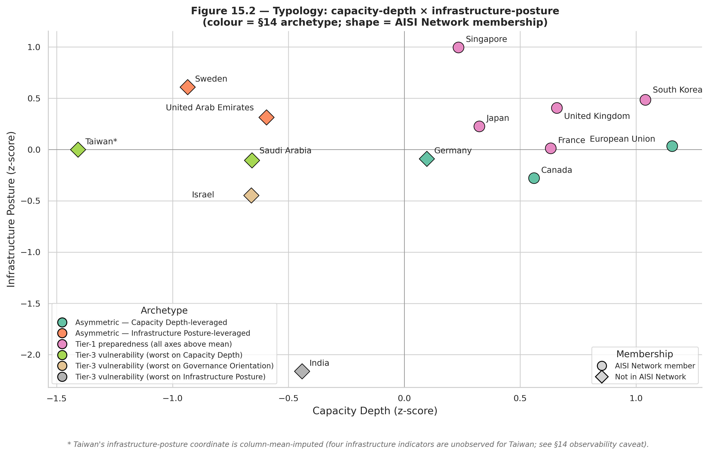
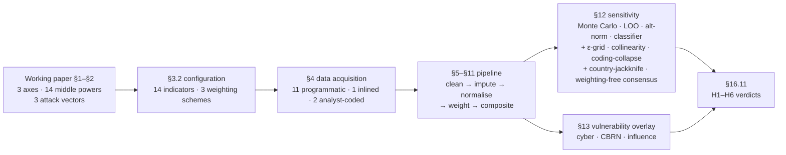

# Middle-Power AI Proliferation Preparedness Index (M-PAPI)

> Companion notebook to *AI-Proliferation and Middle Powers: Preparation and Response Mechanisms* (Teague, Ali, Sfeir, Fort — working paper, 2026).

The notebook empirically operationalises the working paper's three-axes framework — **Capacity Depth**, **Governance Orientation**, **Infrastructure Posture** — across the 14 middle powers named in the paper, and reports per-country preparedness rankings against the three attack vectors discussed in §2 (cyber, CBRN, influence operations).

> **Scope.** M-PAPI quantifies the paper's §1 (axes / country set) and §2 (attack vectors) only. The paper's §3 (trigger-event ladder) and §4 (Detection / Escalation / Mitigation & Containment checklist) are **not** operationalised here — a country-year AI-attributed incident dataset would be required for §3, and §4's checklist actions are surfaced in this notebook only as the §13.4 counterfactual policy-action scenarios, not as country-year preparedness outcomes (see [What the index does and does not claim](#what-the-index-does-and-does-not-claim) for the full scope statement).

## Table of contents

- [Quick start](#quick-start)
- [Headline result](#headline-result)
- [Interactive dashboard (Power BI)](#interactive-dashboard-power-bi)
- [Methodology overview](#methodology-overview)
- [Data sources](#data-sources)
- [Hypothesis-testing results](#hypothesis-testing-results)
- [Notebook structure](#notebook-structure)
- [Reproducibility](#reproducibility)
- [File layout](#file-layout)
- [What the index does and does not claim](#what-the-index-does-and-does-not-claim)
- [How to cite](#how-to-cite)
- [License](#license)

## Quick start

```bash
pip install -r requirements.txt
jupyter nbconvert --to notebook --execute --inplace M-PAPI.ipynb
```

The bundled `data/raw/` snapshot makes the analysis fully reproducible offline. **For byte-stable reproduction against the shipped snapshot, run with `MPAPI_OFFLINE=1`** (e.g. `MPAPI_OFFLINE=1 jupyter nbconvert --to notebook --execute --inplace M-PAPI.ipynb`), which reads only the cache and never touches the network. Without that flag, every run attempts a live re-fetch *first* and overwrites the cache on success (falling back to cache only on network failure); because two sources are upstream-versioned (OpenAlex Concepts, V-Dem annual releases), an online run can therefore produce values that differ from the bundled snapshot.

**Execution fallback.** `jupyter nbconvert --execute` relies on nbconvert's exporter configuration. If it fails for a reason unrelated to this repository — e.g. a stale *global* Jupyter config referencing an uninstalled extension such as `jupyter_contrib_nbextensions` — run the notebook either through the GUI (open `M-PAPI.ipynb` in JupyterLab or Jupyter Notebook → **Run All**) or from the command line via `nbclient`, which bypasses nbconvert's exporter layer and reads the notebook as UTF-8:

```bash
python -c "import nbformat; from nbclient import NotebookClient; nb = nbformat.read('M-PAPI.ipynb', as_version=4); NotebookClient(nb).execute(); nbformat.write(nb, 'M-PAPI.ipynb')"
```

`nbformat` and `nbclient` ship as `nbconvert` dependencies, so no extra install is required; prefix with `MPAPI_OFFLINE=1` for byte-stable offline reproduction. (On Windows, prefer this `nbclient` form or the GUI over `jupyter execute`, which can mis-read the UTF-8 notebook under a non-UTF-8 system locale.)

**Optional system dependency:** the C4 (Stanford AI patents) and I1 (ITU IDI) indicators source from public PDFs that are pre-extracted to `.txt` and bundled in `data/raw/`. If you re-fetch the underlying PDFs, regenerating the `.txt` requires `pdftotext -layout` from [Poppler](https://poppler.freedesktop.org/) on PATH. macOS: `brew install poppler`; Debian/Ubuntu: `apt install poppler-utils`; Windows: install via Poppler-Windows or MiKTeX. With the bundled `.txt` cache present, this dependency is not exercised.

**Clone-folder name:** the GitHub repo is named `middle-powers-mpapi`; `git clone` will land in that folder regardless of any other local name. The notebook resolves paths from `Path.cwd()` at runtime, so the folder name is not load-bearing — run `jupyter nbconvert ... M-PAPI.ipynb` from the repo root.

## Headline result

Literature-weighted composite ranking (full table and per-scheme variants in §11 of the notebook). **South Korea and the UK are the two co-leaders: Korea ranks 1st under the equal and literature schemes, the UK 1st under PCA-derived weighting.** Under the headline literature scheme Korea leads the UK 2.238 to 2.178, and both carry a Monte Carlo median rank of 2 — best read as a close 1–2 pair, not a strict separation.

| Rank | Country     | Composite | Rank | Country      | Composite |
| ---- | ----------- | --------- | ---- | ------------ | --------- |
|    1 | South Korea |     2.238 |    8 | Canada       |     1.383 |
|    2 | UK          |     2.178 |    9 | Sweden       |     1.049 |
|    3 | France      |     1.928 |   10 | UAE          |     0.885 |
|    4 | Japan       |     1.764 |   11 | Saudi Arabia |     0.793 |
|    5 | EU          |     1.750 |   12 | Israel       |     0.132 |
|    6 | Singapore   |     1.731 |   13 | India        |     0.103 |
|    7 | Germany     |     1.411 |   14 | Taiwan       |     0.060 |



> *Figure 15.2 of the notebook — country positions on Capacity Depth × Infrastructure Posture. Colour encodes the §14 per-country archetype, derived from each country's own axis z-profile (not the k-means cluster id): Tier-1 preparedness (all axes above mean) · Asymmetric–Capacity-leveraged · Asymmetric–Infrastructure-leveraged · and three Tier-3 vulnerability variants tagged by worst axis (Capacity, Governance, or Infrastructure) — six categories in total. Marker shape encodes AISI Network membership. Taiwan's infrastructure coordinate is column-mean-imputed (the four infrastructure indicators are unobserved for Taiwan; see §14 observability caveat).*

### Tier stability across weighting schemes

- The **top-5 set** {UK, South Korea, France, EU, Japan} is identical across all three weighting schemes (equal, PCA-derived, literature-elicited). Within it, Korea ranks 1st under the equal and literature schemes and the UK 1st under PCA (the two co-lead).
- The **bottom-3 set** contains {India, Taiwan} under every scheme; the third slot is Israel under the literature scheme and Saudi Arabia under the equal and PCA schemes.
- **Robustness** (`outputs/robustness_summary_with_ci.csv`): every perturbation reports Spearman ρ ≥ 0.96. Under the Bonett–Wright Spearman SE, the equal-vs-PCA, z-vs-min-max, and equal-vs-literature perturbations all clear the stricter 0.85 bar (95% CI lower bounds 0.911, 0.861, and 0.861); only the classifier-sensitivity check (ρ = 0.960, CI lower bound 0.845) sits below 0.85 — it clears the 0.70 robustness floor but not the stricter classifier bar, so the ranking is robust to weighting and normalisation and borderline to the C3 concept choice (this is why H4 is *partially* supported).

### Tier stability is partial — single-slot cycling

Per `outputs/h6_set_membership.json` (computed in §16.11):

- **All five baseline top-5 countries** appear in the top-5 in ≥ 70% of the 10,000 Monte Carlo draws (GBR 98.3%, KOR 98.2%, FRA 84.4%, JPN 81.8%, EU 76.7%), so the top-5 tier passes its per-member criterion.
- **The bottom-3 tier is weaker:** no bottom-3 member clears 80% (India 75.1%, Taiwan 61.3%, Israel 50.4%), so the bot-3 per-member criterion fails — Israel in particular swaps in and out of the bottom-3 with Saudi Arabia.
- **Within-1-swap tolerance** (at most one country differs from the baseline tier): 92% of top-5 draws, 66% of bot-3 draws.
- **Exact set-match**: only ~48% of top-5 draws and ~23% of bot-3 draws because the 5th and 12th slots cycle.

### Within-tier ordering caveats

- The **EU has the widest in-tier IQR** (≈ 3, p10–p90 = 1–7) because the EU row is partly synthetic (no upstream source publishes an EU-level aggregate; the row is constructed from member-state sums / means per §5.2; see §16.9 cross-validation).
- **The UK and Korea both have Monte Carlo median rank 2** (UK p10–p90 1–4, IQR 2; Korea 1–3, IQR 1 — the tightest top distribution). Under point scores Korea is 1st under the equal and literature schemes and the UK 1st under PCA.
- The **{France, Japan, EU} block at positions 3–5** is weight-sensitive: France 1.928, Japan 1.764, EU 1.750 — Monte Carlo gives all three a median rank of 4 (the EU's wide spread, p10–p90 = 1–7, reflects its partly-synthetic row).
- **Middle ranks (positions 7–10) are weight-sensitive** — cite with the Monte Carlo IQR range from `outputs/sensitivity_ranks.csv`, not as point ranks.

## Interactive dashboard (Power BI)

For policy / government audiences (DFAT, GAC, MOFA, AISI-equivalent bodies) who consume empirical work through Power BI, the assembled dashboard ships at the repo root as **[`M-PAPI-Dashboard.pbix`](M-PAPI-Dashboard.pbix)**. It is built on the star-schema data layer emitted by §20 of the notebook to `outputs/pbi/`.

| File | Purpose |
|---|---|
| [`M-PAPI-Dashboard.pbix`](M-PAPI-Dashboard.pbix) | Assembled 2-page dashboard — open in Power BI Desktop (Free) |
| [`outputs/pbi/README.md`](outputs/pbi/README.md) | Data-layer schema reference (3 dim + 5 fact tables, relationships, column conventions) |

The 2-page layout:

- **Page 1 — Overview.** Sortable ranking table with weighting-scheme slicer (equal / PCA / literature); interactive Capacity × Infrastructure typology scatter coloured by §14 archetype, shape-coded by AISI Network membership; archetype button slicer acting as legend and filter; robustness-CI bar chart for the four H4 perturbations.
- **Page 2 — Country drill-through.** Country + weighting-scheme slicers; per-axis profile; per-vector vulnerability ranking; Shapley waterfall over 14 indicators; **counterfactual what-if** with four binary toggles for the §13.4 actions (e.g. setting `JOIN_AUSTRALIA_GROUP` from 0 to 1 with Singapore selected raises its composite from 1.731 to 1.841, moving it from rank 6 to rank 4); Monte Carlo rank-range card.

To refresh after a notebook re-run: open the `.pbix`, Home → Refresh.

## Methodology overview

The methodology follows the OECD/JRC *Handbook on Constructing Composite Indicators* (2008). The 10-step process is mapped to notebook sections in §3.


```mermaid
flowchart LR
  Paper["Working paper §1–§2<br/>3 axes · 14 middle powers<br/>3 attack vectors"]
  Config["§3.2 configuration<br/>14 indicators · 3 weighting schemes"]
  Acq["§4 data acquisition<br/>11 programmatic · 1 inlined · 2 analyst-coded"]
  Pipeline["§5–§11 pipeline<br/>clean → impute → normalise<br/>→ weight → composite"]
  Sens["§12 sensitivity<br/>Monte Carlo · LOO · alt-norm · classifier<br/>+ ε-grid · collinearity · coding-collapse<br/>+ country-jackknife · weighting-free consensus"]
  Overlay["§13 vulnerability overlay<br/>cyber · CBRN · influence"]
  Verdicts["§16.11<br/>H1–H6 verdicts"]
  Paper --> Config --> Acq --> Pipeline
  Pipeline --> Sens
  Pipeline --> Overlay
  Sens --> Verdicts
  Overlay --> Verdicts
```

### Three axes (working paper §1)

| Axis | Definition (per paper §1) | Indicators |
|---|---|---|
| **Capacity Depth** | Domestic technical talent, AISI-equivalent institutions, AI R&D output | C1 Notable models · C2 Training compute · C3 AI publications · C4 AI patents · C5 AISI presence |
| **Governance Orientation** | AI governance maturity, alliance posture, bilateral lab agreements | G1 National AI strategy · G2 ITU GCI · G3 V-Dem LDI · G5 IGSC member firms · G6 Australia Group *(bilateral lab MoUs discussed qualitatively — the former G4 count was dropped from scoring for lack of a reproducible authoritative source; see Data sources)* |
| **Infrastructure Posture** | ICT infrastructure, connectivity, platform/cloud presence (paper names it *Compute and Infrastructure Posture*; **no compute indicator in this build** — I4 deferred, see notebook §17.9) | I1 ITU IDI · I2 Broadband · I3 Secure servers · I5 ND-GAIN Readiness |

### Three attack vectors (working paper §2)

Per-vector cross-axis weights are the authors' translation of the paper's §2.2–§2.4 qualitative arguments (full rationale in §13 of the notebook):

| Vector | Paper § | Capacity | Governance | Infrastructure |
|---|---|---|---|---|
| Cyber | §2.2 | 0.40 | 0.25 | 0.35 |
| CBRN | §2.3 | 0.50 | 0.40 | 0.10 |
| Influence operations | §2.4 | 0.20 | 0.35 | 0.45 |

### Composite construction (§9–§11)

- **Normalisation** — z-score across the 14 jurisdictions (min-max as sensitivity in §12.3).
- **Within-axis aggregation** — linear weighted sum.
- **Across-axis aggregation** — geometric mean (penalises imbalance — no axis fully compensates for another, consistent with paper §4).
- **Three weighting schemes reported side-by-side** — equal · PCA-derived · literature-elicited (synthesis of GMF Pivotal Powers + Chatham House Sovereign AI + Tortoise Global AI Index).

### Sensitivity & robustness (§12)

- **Monte Carlo (§12.1)** — 10,000 Dirichlet(α=1) draws perturbing both within-axis and across-axis weights.
- **Leave-one-indicator-out (§12.2)** — rank impact bound for each indicator.
- **Alternative normalisation (§12.3)** — min-max vs z-score Spearman ρ.
- **Classifier sensitivity (§16.7.1)** — AI-broad vs ML-narrow OpenAlex concepts for C3.
- **Geometric-shift ε sensitivity (§12.6)** — a five-value ε grid (1e-4 … 1.0) bounding the bottom tier's dependence on the geometric-shift constant; separates ε-stable ranks from ε-dependent bottom-tier composite magnitudes.
- **C5×G1 axis-reassignment (§12.7)** — recompute the headline with C5 moved to governance to bound the ordering impact of the C5/G1 cross-axis double-count.
- **Analyst-coded judgment-collapse (§12.8)** — collapse G1/C5 each to its authoritative core (and both at once) to bound how much the interpretive coding layer drives the ranking.
- **Bonett–Wright Spearman Fisher-z 95% CIs** on all four robustness Spearman ρ values (Appendix A.2).
- **Leave-one-country-out jackknife (§12.10)** — exact 14-fold drop-one-country test bounding each jurisdiction's influence on the ranking (Spearman ρ ≥ 0.945) and the typology (ARI).
- **Weighting-free consensus (§12.11)** — Borda and exact Kemeny–Young aggregation of the 14 indicator ballots with no cardinal weights (Borda ρ = 0.979, Kemeny ρ = 0.930 vs the literature ranking) — a weight-free corroboration of the headline.

## Data sources

Every indicator value cites a named source with retrieval date and URL. **12 of the 14 indicators are fully sourced from Tier-1 institutional providers with no analyst-coding step** (11 programmatic + 1 inlined against the cited URL); the remaining 2 carry an analyst-coding step. (A former 15th indicator, G4 bilateral-lab-MoU count, was **excluded from scoring** — see [Excluded indicator](#excluded-indicator-g4) below.)

### Programmatic sources (11 indicators)

Loaded automatically from the cached `data/raw/` snapshot with live re-fetch fallback (retrieval dates recorded in per-file `*.meta.json` sidecars):

| Indicator | Source | Retrieval mechanism |
|---|---|---|
| C1, C2 | Epoch AI Notable Models | Direct CSV download |
| C3 | OpenAlex Works API (concept `C154945302`) | REST API |
| C4 | Stanford AI Index 2025, Figure 1.2.3 | PDF extraction via [`extract_patents_from_pdf.py`](extract_patents_from_pdf.py) |
| G2 | ITU GCI 2024 (5th ed.) via World Bank Data360 | REST API |
| G3 | V-Dem v16 Liberal Democracy Index | GitHub `RData` download |
| G5 | IGSC member roster | HTML scrape via [`extract_igsc_from_html.py`](extract_igsc_from_html.py) |
| I1 | ITU IDI 2024, Report Table 1 | PDF extraction via [`extract_idi_from_pdf.py`](extract_idi_from_pdf.py) |
| I2, I3 | World Bank WDI (broadband + secure servers) | REST API |
| I5 | ND-GAIN Country Index 2026 | ZIP download |

### Inlined against the cited URL (1 indicator)

- **G6 (Australia Group membership, binary 0/1)** — inlined in the `EXTRACTIONS` registry against the cited URL because the upstream page (`australiagroup.net/en/participants.html`) redirects to a DFAT-hosted page that is unreliable for programmatic fetch from many environments. Membership rarely changes in practice (India was the most recent addition, January 2018).

### Analyst-coded indicators (2 indicators)

Flagged `requires_verification: True` in §4.9's `EXTRACTIONS` registry; their literature-scheme weights are documented in §3.2:

- **G1 (national AI strategy comprehensiveness, 0–3 rubric, within governance)** — each value cites a named national strategy document, but the 0–3 rubric (esp. the 2-vs-3 safety-provision boundary) is a single-coder judgment; §4.9.2 provides the drop-in Cohen's κ protocol for a second independent human coder (κ pending), and §12.8 bounds its influence.
- **C5 (AISI presence, 25% within capacity)** — AISI Network membership is authoritative (NIST fact sheet, 7 founding-member middle powers); each non-member `=1` coding (India, Taiwan, Germany) cites a dated AI-safety-body announcement (§4.9.1) and `=0` codings reflect the documented rule that a broad national AI authority does not qualify, so **no C5 value is author-attested**. The only residual judgment is that bright line (stress-tested in §12.8).

Per-country coding protocols and evidence citations for both are recorded in **§4.9.1** (`ANALYST_CODING_EVIDENCE`) — e.g. each G1 score names the underlying national AI strategy (document, body, year), and values resting on authors' attestation rather than a single authoritative dataset are marked as such. Two robustness layers bound their influence: the §12.2 leave-one-indicator-out test shows the **top-5 set is unchanged** when either G1 or C5 is dropped, and **§12.8 collapses each indicator's interpretive layer to its authoritative core** (G1→has-safety-provisions, C5→AISI-Network-member) and confirms the headline ranking is essentially unchanged (`outputs/analyst_coding_audit.csv`). Full bibliography in §19 of the notebook.

### Excluded indicator (G4)

A 15th candidate indicator — **G4, bilateral frontier-lab MoU count** — was **excluded from the scored composite** because, unlike every retained indicator, it has **no reproducible authoritative source**: there is no public registry of government–frontier-lab MoUs, the landscape is fast-moving and definitionally blurred (MoU vs. partnership vs. "OpenAI/Anthropic for Countries" vs. commercial deal), and the documented cases that *do* exist often involve a national AI Safety Institute (e.g. the Anthropic–Japan AISI Memorandum of Cooperation), which would double-count the C5 (AISI presence) signal. Rather than score an indicator that cannot be cited and traced per value, it is excluded; the **bilateral-lab-MoU concept is retained qualitatively** in the discussion, citing the cleanly-documented UK (Anthropic / OpenAI / Google DeepMind) and Australia–Anthropic MoUs as illustration. The §12.2 leave-one-indicator-out test already showed the top-5 set is robust to dropping G4; excluding it permanently leaves Korea and the UK as co-leaders (Korea 2.238 1st under literature, the UK 2.178). G4 = 3 had been the UK's single highest indicator value, but its #1 placement does not depend on it.

## Hypothesis-testing results

Six hypotheses are pre-registered with numeric pass criteria in §1.4 and resolved against those criteria in §16.11:

| ID | Hypothesis | Result | Evidence |
|---|---|---|---|
| **H1** | The three axes are empirically separable. | **PARTIALLY SUPPORTED** | 5 of 65 cross-axis indicator pairs at \|r\| ≥ 0.7 (at the pre-specified ≤5 threshold). The C5 × G1 collinearity (r = 0.965) is the largest contributor and is flagged as high-priority future work in §17.8. |
| **H2** | Each axis carries a one-dimensional latent signal. | **PARTIALLY SUPPORTED** | Infrastructure PA p ≈ 0.01, governance PA p ≈ 0.04 (both significant); capacity-axis dimensionality is empirically untestable at n = 8 complete cases (below the n = 10 testability floor; PC1 ≈ 60% under the 50% heuristic). Governance PC1 explains only ~46% of variance; §16.10 decomposes it into three sparse-PCA sub-axes. |
| **H3** | The 14 middle powers do not cluster homogeneously. | **SUPPORTED** | k-means silhouette = 0.42 at k = 3; ARI = 1.0 against complete and average linkage and 0.73 against Ward; MDS embedding preserves distance rank at ρ = 0.91. |
| **H4** | The headline ranking is robust to methodological perturbation. | **PARTIALLY SUPPORTED** | Under the Bonett–Wright Spearman SE the equal-vs-PCA, z-vs-min-max, and equal-vs-literature perturbations all clear the stricter 0.85 bar (CI lower bounds 0.911 / 0.861 / 0.861); only the classifier-sensitivity check (ρ = 0.960, CI lower bound 0.845) clears 0.70 but sits just below the stricter 0.85 bar applied to the classifier — robust on weighting/normalisation, borderline on the C3 concept choice. |
| **H5** | Top-5 not driven by any single analyst-coded indicator. | **SUPPORTED** | Top-5 set unchanged when either G1 or C5 is dropped; the §12.8 judgment-collapse leaves the headline essentially unchanged (min ρ = 0.9956, max single-country shift = 1). |
| **H6** | Top-5 and bot-3 tier membership stable under weight perturbation. | **PARTIALLY SUPPORTED** | All five baseline top-5 members appear in the top-5 in ≥ 70% of 10,000 Monte Carlo draws (PASS); no bottom-3 member clears 80% (India 75.1%, Taiwan 61.3%, Israel 50.4%), so the bot-3 per-member criterion fails — Israel is the least stable, cycling with Saudi Arabia. |

Aggregate: two fully supported (H3, H5), four partially supported (H1, H2, H4, H6) with specific named caveats. The composite-index framework is empirically defensible; the partial-support verdicts surface methodological caveats (C5 × G1 collinearity, governance multidimensionality, the classifier robustness check borderline at the stricter 0.85 bar, and a weight-sensitive bottom tier) rather than a wholesale framework failure.

### Targeted robustness checks beyond H1–H6

Several additional sensitivity tests were added in response to anticipated supervisor-review concerns. None reorders the top-5 set; each surfaces a quantitative answer to a specific framework concern:

| Check | Concern addressed | Result | Persisted to |
|---|---|---|---|
| **§12.2.1 C4-drop sensitivity** | Does Korea's #1 position depend on a single Stanford-Top-15 patent figure? | Spearman ρ(baseline_rank, C4-drop_rank) = +0.9956 (Fisher-z 95% CI [+0.981, +0.999]). Korea rank 1 → 2 — it slips one place but Tier-1 placement survives. | LOO row in `outputs/sensitivity_ranks.csv`; printed in §12.2.1. |
| **§13.5 V-Dem polarity sensitivity** | Paper §2.4 argues democracies are *more* exposed to influence operations — does flipping V-Dem polarity within the influence-ops vector reshape the per-vector ranking? | Spearman ρ(baseline_infl_rank, V-Dem-flipped_infl_rank) = +0.9341 (Bonett–Wright Fisher-z 95% CI [+0.754, +0.984]). Flipping V-Dem polarity (democracy read as vulnerability rather than resilience) moves lower-democracy states up and higher-democracy states down, as paper §2.4 predicts: UAE rises 10 → 7, Saudi Arabia 11 → 9 and Singapore 3 → 1, while Korea falls 1 → 3, Germany 8 → 10, Canada 9 → 11 and Sweden 7 → 8. The UK, France, Japan, EU, India, Israel and Taiwan are unchanged. | `outputs/vdem_polarity_sensitivity.csv`. |
| **§16.11(d) H6 mechanical verdict** | The §1.4 pre-registered criterion for H6 was prose-only; encode the asymmetric thresholds (≥ 4/5 top-5 members in ≥ 70% of draws AND ≥ 2/3 bot-3 members in ≥ 80% of draws) as a mechanical PASS/FAIL. | **Combined FAIL** (top-5 PASS, bot-3 FAIL). Top-5: 5/5 members in tier in ≥ 70% of draws (UK 98.3%, Korea 98.2%, France 84.4%, Japan 81.8%, EU 76.7%) → PASS at 4/5; bot-3: 0/3 members in tier in ≥ 80% (India 75.1%, Taiwan 61.3%, Israel 50.4%) → FAIL at 2/3. The overall H6 verdict is PARTIALLY SUPPORTED: the top tier is stable, but the bottom tier is weight-sensitive (no member clears 80%). | `outputs/h6_set_membership.json`, key `per_country_in_tier_mechanical_verdict`. |
| **§12.6 geometric-shift ε sensitivity** | The composite shifts z-scored axes by `+ ε` (ε = 1e-3) before the geometric mean; ε is the one aggregation constant §12.1–§12.5 never perturb, and the country at an axis minimum contributes `log(ε)`. Does the bottom tier depend on it? | Across ε ∈ {1e-4, 1e-3, 1e-2, 1e-1, 1.0} the **ranking is ε-invariant** (Spearman ρ = 1.000 for ε ≤ 0.1; ρ = 0.978 at ε = 1.0). But the **bottom-tier composite values are an ε-artifact**: Taiwan's composite spans 0.024 → 1.56 and Israel's 0.066 → 1.69 across the grid (~65× / ~26×). **Cite the bottom tier as ranks, not magnitudes.** | `outputs/eps_sensitivity.csv`; printed in §12.6. |
| **§12.7 C5×G1 axis-reassignment** | C5 (AISI presence, capacity) and G1 (AI strategy, governance) are near-collinear (r = 0.965), so the shared AI-safety-institution signal loads into two axes. How much of the ranking is the double-count? | Reassigning C5 to governance (the §17.13 alternative #1) under equal within-axis weights gives Spearman ρ = +0.9868 (Bonett–Wright Fisher-z 95% CI [+0.945, +0.997]); the **top-5 set is unchanged** and the **max single-country shift is 1**. The double-count inflates the Tier-1↔Tier-3 gap without re-ordering the table. | `outputs/collinearity_recode.csv`; printed in §12.7. |
| **§12.8 analyst-coded judgment-collapse** | G1/C5 carry one interpretive layer each (G1's 2-vs-3 safety boundary, C5's "announced" ordinal). How much does that judgment drive the ranking? | Collapsing each to its authoritative core — and both at once — leaves the headline **essentially unchanged: min Spearman ρ = 0.9956, top-5 preserved, max single-country shift = 1**. (G1 takes only {2,3} in-sample, so its binary collapse is a structural no-op under z-scoring; the C5 collapse {0,1,3}→{0,1} is a genuine category merge and moves a single mid-table position.) | `outputs/analyst_coding_audit.csv`; printed in §12.8. |


> *Figure 12.5 of the notebook — H4 evidence in visual form. Each row is one robustness perturbation; the horizontal bar is the Spearman ρ point estimate flanked by its Fisher-z 95% CI. The dashed red lines mark the pass threshold for that perturbation (0.70 for the three weighting / normalisation tests; 0.85 for the bibliographic-classifier test). A perturbation passes iff the CI's lower bound sits to the right of its threshold — under the Bonett–Wright Spearman SE the equal-vs-PCA, normalisation, and equal-vs-literature tests pass with margin (the last clearing 0.85 at CI lower bound 0.861), while only the classifier test is borderline (CI lower bound 0.845, just left of the 0.85 line applied to the classifier).*

## Notebook structure

The 186-cell notebook follows the OECD/JRC 10-step composite-indicator process and emits a Power BI consumption layer:

| § | Content |
|---|---|
| **§1** | Introduction, paper-mapping (§1.3), and six pre-registered hypotheses (H1–H6 in §1.4) |
| **§2** | Conceptual framework — three axes, three attack vectors, composite logic |
| **§3** | Methodology overview — explicit 10-step OECD/JRC mapping |
| **§4** | Data acquisition — §4.1–§4.9 programmatic + inline sources; §4.9.1 analyst-coded protocols + per-country evidence; §4.9.2 G1 inter-rater (Cohen's κ) scaffold |
| **§5** | Data cleaning & harmonisation — EU aggregation, reference-period alignment, missing-data audit |
| **§7.1** | Per-cell provenance ledger — observed / inlined / analyst-coded / imputed status + source per cell (`outputs/indicator_provenance.csv`) |
| **§6** | Indicator construction — per-indicator transforms (log1p for skewed counts/rates; identity otherwise; the `apply_transform` helper also supports sqrt and binary, unused in this configuration) |
| **§7** | Two-stage imputation — axis-mean in z-space (stage 1) + column-mean fallback (stage 2) |
| **§8** | Multivariate diagnostics — per-axis PCA + Horn's parallel analysis (§8.1) |
| **§9–§11** | Normalisation, weighting, composite computation |
| **§12** | Sensitivity & robustness — Monte Carlo · LOO · alternative normalisation · classifier · geometric-shift ε grid (§12.6) · C5×G1 axis-reassignment (§12.7) · analyst-coded judgment-collapse (§12.8) · leave-one-country-out jackknife (§12.10) · weighting-free consensus ranking (§12.11) |
| **§13** | Vulnerability overlay — per-vector preparedness rankings; counterfactual policy scenarios (§13.4); V-Dem polarity (§13.5) and overlay-weight Monte Carlo (§13.6) sensitivities; minimal-action-set optimisation (§13.7); causal-interpretation boundary (§13.8) |
| **§14** | Typology — k-means + silhouette · hierarchical clustering · MDS embedding |
| **§15** | Visualisation — six subsections §15.1–§15.6; five render paper-facing figures (§15.5 is a numerical EU vs member-state cross-validation, not a figure) |
| **§16** | Discussion — paper-§-by-paper-§ mapping (§16.1–§16.7); sparse-PCA governance sub-axes (§16.10); hypothesis verdicts (§16.11) |
| **§17** | Limitations (§17.1–§17.10) · four-validity-types audit (§17.11) · methodological reflections (§17.12) · considered-but-not-adopted framework alternatives (§17.13) · future-work priorities |
| **§18** | Reproducibility verification — robustness-summary read-back + full GBR composite reconstruction (asserted within 1e-3) + source-URL liveness probe (§18.1); output-file/figure existence is verified in §21 (after all artifacts exist) |
| **§19** | Bibliography |
| **§20** | Power BI dashboard data layer — emits 3 dim + 5 fact CSVs to `outputs/pbi/` consumed by the shipped `M-PAPI-Dashboard.pbix` at the repo root |
| **§21** | Final verification & hypothesis-verdict cross-check — runs after every artifact is generated: confirms the full output-file and figure set exists, then re-reads the persisted `outputs/`, evaluates each §1.4 pass criterion, and asserts the H1–H6 criterion outcomes still match the §16.11 verdicts (fails the build on drift); writes `outputs/hypothesis_verdicts.csv` |
| **Appendix A** | Methodology hygiene — cross-axis correlations · Fisher-z CIs · Cronbach α |
| **Appendix B** | Interpretability — exact 2¹⁴ Shapley decomposition (B.1) · permutation feature importance (B.2) · Shapley interaction indices (B.3) |
| **Concluding Remarks** | Workflow recap, headline findings, reproducibility note |

## Reproducibility

- **Random seed** — `SEED = 20260506` (defined in §3.1), passed explicitly to all seven stochastic entry points:
  - `np.random.default_rng(SEED)` for the §12.1 Monte Carlo weights
  - `parallel_analysis_pca(seed=SEED)` for the §8.1 Horn's parallel-analysis null
  - `np.random.default_rng(SEED + 101)` for the §12.9 joint rank-uncertainty Monte Carlo
  - `KMeans(random_state=SEED)` for the §14 k-means typology
  - `MDS(random_state=SEED, n_init=20)` for the §14.3 embedding
  - `SparsePCA(random_state=SEED)` for the §16.10 governance sub-axes
  - `np.random.default_rng(SEED)` for the §B.2 permutation feature importance
- **Pinned `RUN_DATE`** — `RUN_DATE = "2026-05-06"` (defined in §3.1, same constant as the seed date) so the build stamp is identical across re-runs. Override with the `MPAPI_RUN_DATE` environment variable if you want a live `date.today()`.
- **Byte-identical regeneration** — within a fixed Python environment (Python 3.14.x, the pinned versions in `requirements.txt`, and the same matplotlib backend), all 35 output files (32 CSV + 3 JSON) and all 23 figures reproduce byte-for-byte across successive notebook re-runs (run with `MPAPI_OFFLINE=1` so live re-fetches cannot perturb the inputs). Cross-environment byte-identity is not asserted; matplotlib version bumps in particular can shift figure bytes even when pixels are visually identical.
- **Cached snapshot** — the current `data/raw/` snapshot is bundled with the repo. By default `fetch_to_cache` is **live-first, not cache-first**: every run attempts a live re-fetch and overwrites the cache on success, using the cache only as a network-failure fallback. Set `MPAPI_OFFLINE=1` to force cache-only reads with no network access — the recommended mode for byte-stable reproduction of the shipped snapshot (§4.x cells share the `fetch_to_cache` helper).
- **Retrieval-date sidecars** — every cached source under `data/raw/` (programmatic fetches, source PDFs, derived CSVs from the `extract_*.py` scripts) has a `*.meta.json` sidecar recording its URL, retrieval date, byte size, and a short provenance note.
- **Upstream-versioning caveat** — the OpenAlex C3 concept counts (and the §16.7.1 ML-narrow variant) and the V-Dem v16 LDI are upstream-versioned: OpenAlex periodically re-runs concept classification and V-Dem ships annual revisions, so a re-fetch in a future year will not necessarily reproduce the bundled snapshot. The methodology is stable; the bundled values are a fixed retrieval snapshot — programmatic API sources retrieved 2026-05-06, the PDF/HTML-derived sources (Stanford patents, ITU IDI, IGSC roster) retrieved 2026-05-18, per the `*.meta.json` sidecars (§17.10).
- **Repository size** — `data/raw/vdem.RData` is ≈ 34 MB and dominates clone size. If this becomes a problem, migrate `data/raw/vdem.RData` to Git LFS; the loader (§4.3) is agnostic to storage backend.
- **End-to-end verification** — §18 reads back the consolidated robustness summary and reconstructs the GBR composite from raw data (asserted within `1e-3`); §21 (after all artifacts are generated) verifies the full output-file and figure set exists and then re-derives the H1–H6 verdicts. Appendix B.1 additionally asserts Shapley additivity within `1e-6`. §18.1 probes the liveness of every cited source URL on each rebuild — and is skipped automatically under `MPAPI_OFFLINE=1` so the offline contract (no network access) holds end-to-end.

## File layout

```text
M-PAPI.ipynb                  — the notebook (186 cells: config · data · analysis · bibliography · PBI export)
README.md                     — this file
LICENSE                       — MIT for code; per-source attribution for upstream data
requirements.txt              — Python dependency floor
.ruff.toml                    — lint config (target-version py311; E402 exempt for .ipynb)
.gitignore                    — standard Python / Jupyter / IDE ignores + *.pbip
extract_idi_from_pdf.py       — ITU IDI 2024 PDF Table 1 → CSV (called by §4.7)
extract_igsc_from_html.py     — IGSC member roster HTML → CSV (called by §4.5)
extract_patents_from_pdf.py   — Stanford AI Index Fig 1.2.3 PDF → CSV (called by §4.8)
data/raw/                     — cached source files + .meta.json retrieval sidecars (bundled snapshot)
figures/                      — 23 PNG figures exported by the notebook
outputs/                      — 35 outputs (32 CSV + 3 JSON) of index, sensitivity, and verdict tables
outputs/pbi/                  — 8 star-schema CSVs (3 dim + 5 fact) + README for Power BI ingestion (§20)
M-PAPI-Dashboard.pbix         — assembled 2-page Power BI dashboard (Overview + Country drill-through)
```

## What the index does and does not claim

### Does claim

- Each of the 14 middle powers can be ranked on each of the three axes using publicly available authoritative data.
- The top-5 set and the bottom-3 set are stable to reasonable variation in weighting and normalisation; within-tier ordering and the marginal slot (5th, 12th) is weight-sensitive.
- A k-means typology of axis-position archetypes is reported alongside its cluster-validity diagnostics (silhouette score, hierarchical-clustering ARI).

### Does not claim

- That the index predicts which country will suffer the next AI-enabled incident.
- That a high score means a country is "safe".
- That all relevant dimensions of preparedness are captured (see §17 Limitations).
- That the per-country composite values are portable outside the 14-country reference frame (see §11 portability caveat).
- That the bottom-tier composite *values* are precise: they are sensitive to the geometric-shift constant ε (see §12.6 ε-sensitivity grid); only the *ranks* are interpretable at the bottom of the table.
- That the working paper's §3 trigger-event framework is operationalised here — it is not, pending country-year AI-attributed incident data (see §17.7).

## How to cite

```bibtex
@unpublished{teague2026middlepowers,
  author = {Teague, James and Ali, Alina and Sfeir, Sophie and Fort, Kristina},
  title  = {AI-Proliferation and Middle Powers: Preparation and Response Mechanisms},
  year   = {2026},
  note   = {Working paper. Companion notebook: \url{https://github.com/khailapvuong/middle-powers-mpapi}}
}
```

Or in prose:

> Teague, J., Ali, A., Sfeir, S., & Fort, K. (2026). *AI-Proliferation and Middle Powers: Preparation and Response Mechanisms*. Working paper. Companion notebook: <https://github.com/khailapvuong/middle-powers-mpapi>

## License

- **Notebook and Python code** — MIT (see [`LICENSE`](LICENSE)).
- **Upstream data sources** — each retains its own licence: Epoch AI CC-BY 4.0 · World Bank CC-BY 4.0 · OpenAlex CC-0 · V-Dem CC-BY · ND-GAIN free with attribution · ITU citable academic use · Stanford HAI free with attribution · AISI Network (NIST) U.S. public domain · IGSC public roster · Australia Group public roster.

Full per-source attribution and licence terms in §19 of the notebook.
